 # 1. Advance

  

> Vì muốn thử triển khai với *Terraform* và *Ansible* nên em sẽ sử dụng 2 Tool này để thực hiện bài lab.
> 
> Github Repo: https://github.com/mquang279/cloud/tree/main/openstack-networking

Kiến trúc triển khai như hình trên, với cấu hình của từng VM là:
- **VM1:** 20GB Disk, 4GB Ram, Ubuntu Server 22.04
- **VM2:** 20GB Disk, 4GB Ram, Ubuntu Server 22.04
- **VM3:** 10GB Disk, 2GB Ram, Ubuntu Server 22.04

Đầu tiên, sử dụng *Terraform* và *libvirt* để tạo VM1 & VM2 bao gồm các bước:
- Tạo base image
- Tạo overlay disk cho VM dựa trên base image
- Render file cloud init cho từng VM để cấu hình user, cài đặt package cần thiết.
- Tạo cloud init ISO cho từng VM
- Tạo VM với cấu hình như phía trên, mở CPU passthrough.

Tạo SSH key pair trên máy bare-mental và copy public key vào 2 VM vừa tạo:

Chạy Ansible-playbook để tạo ra VM3 bên trong VM1 bao gồm các bước như hình sau:

Chạy Ansible-playbook để tạo default storage pool bên trong VM2 bao gồm các bước như hình sau
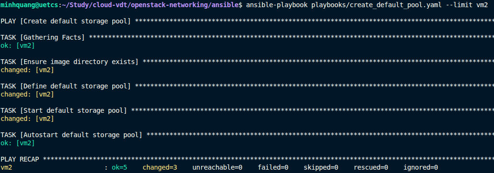

Kiểm tra IP của VM3, danh sách VM trong VM1 và danh sách VM trong VM2
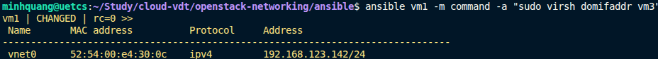

  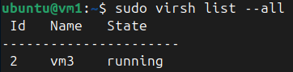

  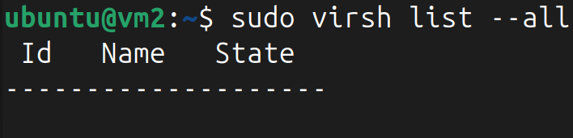

SSH vào VM1 và thực hiện live migrate VM3 từ VM1 sang VM2:

  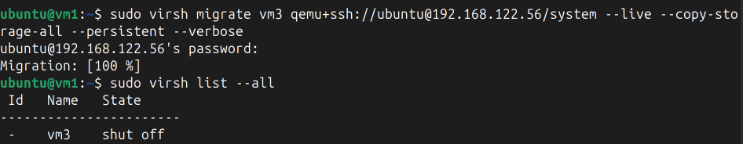

  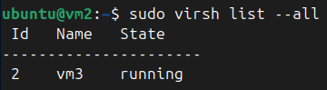

**Tham khảo:**
- https://github.com/ArmanTaheriGhaleTaki/terraform-libvirt-sample
- https://oneuptime.com/blog/post/2026-03-04-manage-virtual-machine-storage-pools-volumes-rhel/view#creating-a-directory-based-storage-pool
- https://phip1611.de/blog/live-migration-of-qemu-kvm-vms-with-libvirt-command-cheat-sheet-and-tips/
- https://forum.ansible.com/t/creating-a-new-vm-with-libvirt-am-i-doing-this-right/43560
- ChatGPT
# 2. Expert

  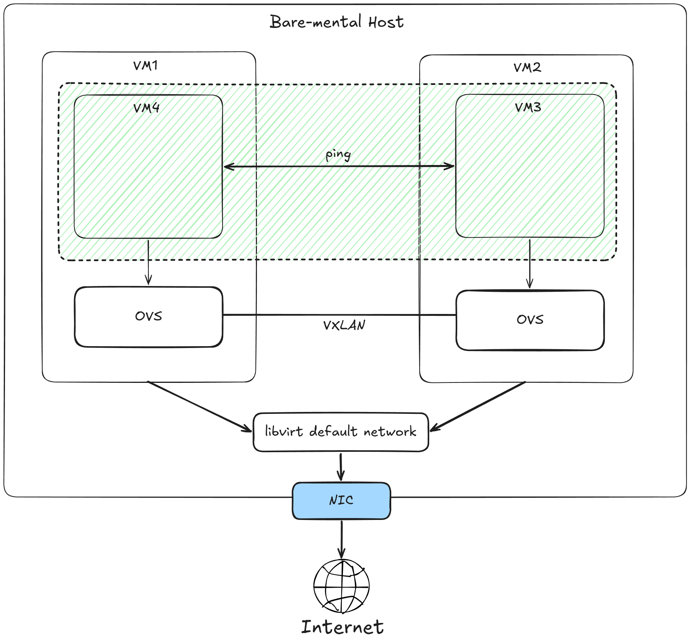

> Em sẽ tái sử dụng code *Terraform* và các *Ansible playbook* ở lab Advance để tạo VM và các nested VM.
>
> Github Repo: https://github.com/mquang279/cloud/tree/main/openstack-networking

Dựa vào hạ tầng đã tạo sẵn ở lab **Advance**, em sẽ tạo thêm VM4 bên trong VM1 sử dụng Ansible-playbook tương tự phía trên
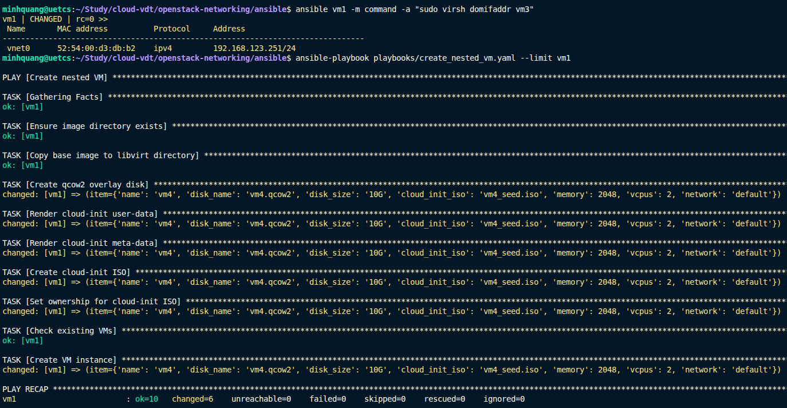

Cloud-init config khi tạo VM1, VM2 bằng Terraform đã cài đặt sẵn package Open vSwitch. Tạo OVS bridge và VXLAN Tunnel gán với bridge trên VM1, VM2.

  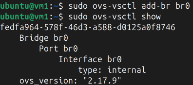

  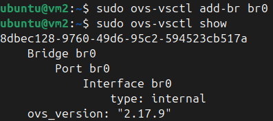

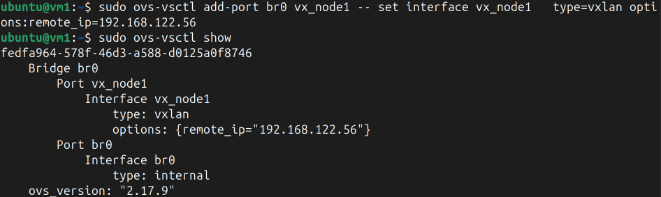
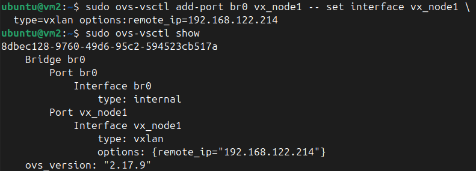

Attach VM3, VM4 vào OVS Bridge đã tạo trên VM1, VM2
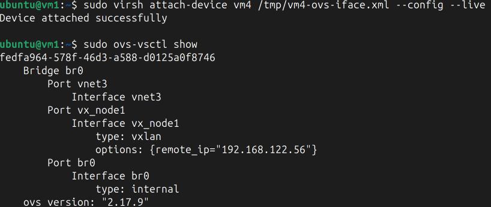
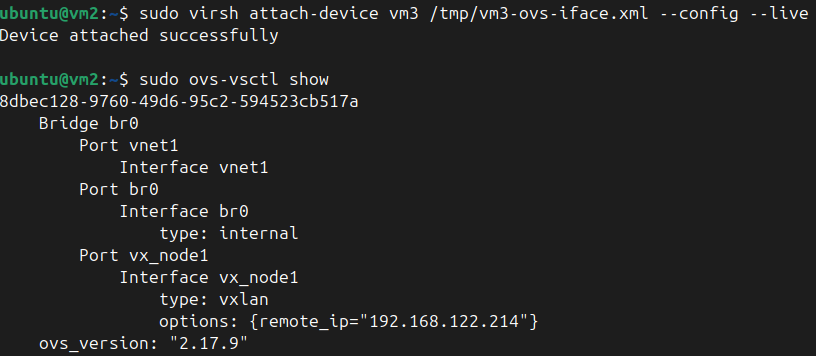

Gán IP cho VM3 và VM4 cùng subnet sử dụng rải mạng `10.0.0.0/24`
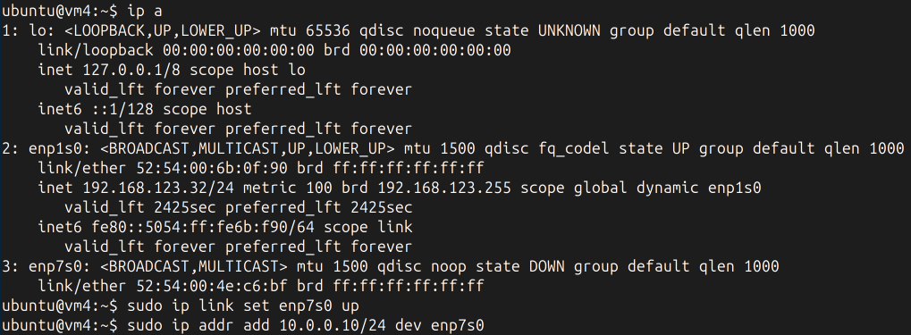
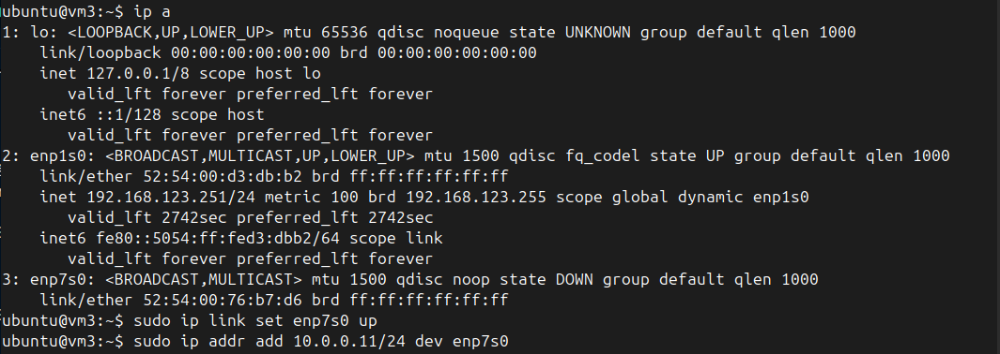

Ping qua lại giữa VM3 và VM4
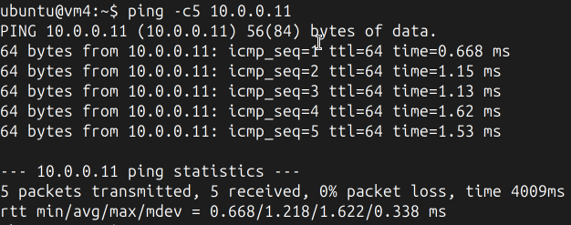
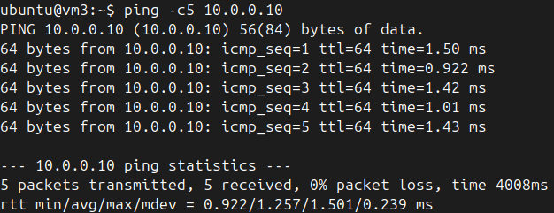

**Tham khảo:**
- https://docs.openvswitch.org/en/latest/faq/vxlan/
- https://blog.oddbit.com/post/2021-04-17-vm-ovs-vxlan/
- https://gist.github.com/miladjahandideh/fa2dab5aa64e41bb80625541119105e1
- ChatGPT