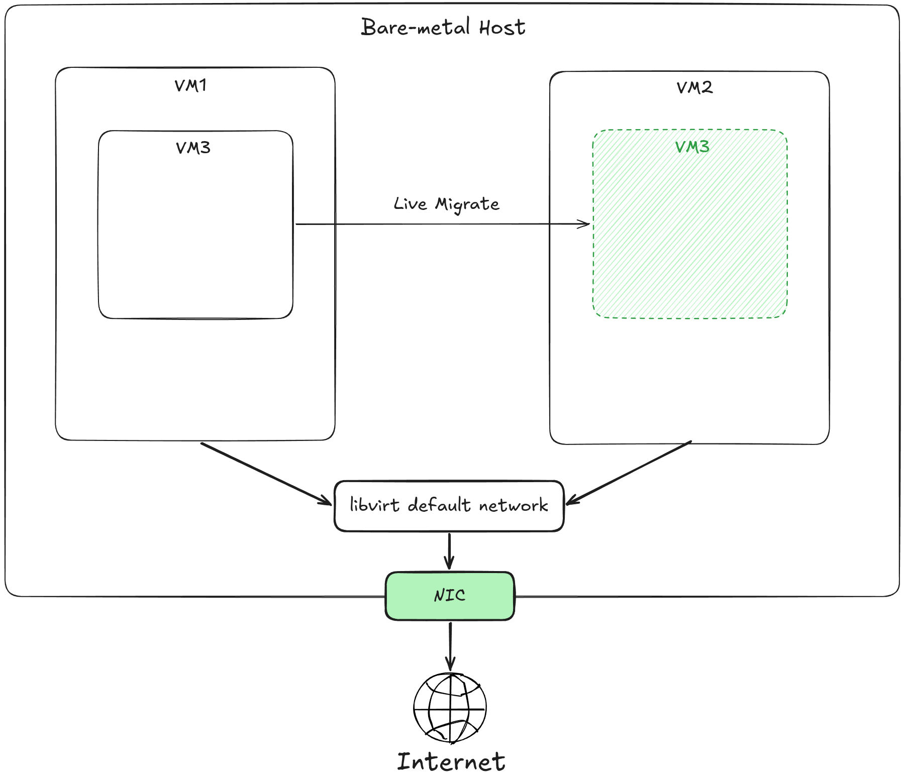
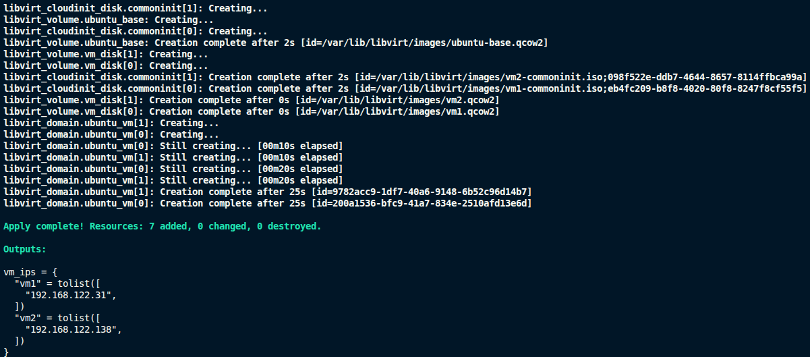
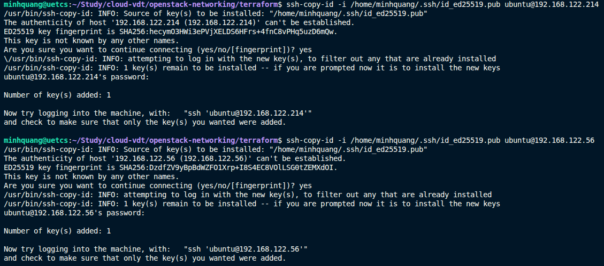
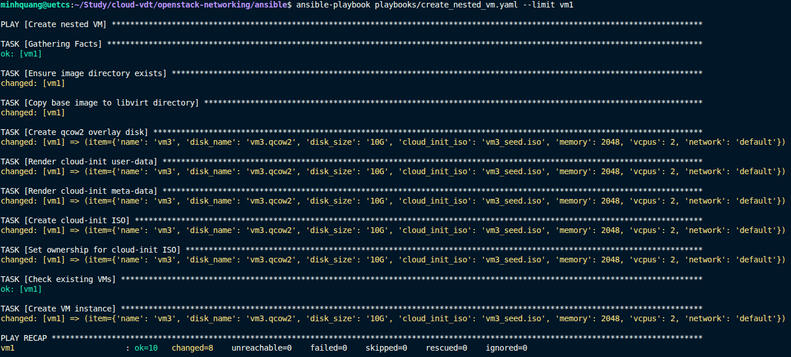

# 1. Basic

# 2. Advance
Đầu tiên, sử dụng Terraform và libvirt để tạo 2 VM (VM1 & VM2) với vai trò là 2 host có cấu hình: 20GB Disk, 4GB Ram, Ubuntu Server 22.04

Tạo SSH key-gen và copy vào 2 VM vừa tạo

Tiếp theo, chạy Ansible-playbook để tạo ra VM3 bên trong VM2 với cấu hình của VM3 là: 10GB Disk, 2GB Ram, Ubuntu Server 22.04

Chạy Ansible-playbook để tạo default storage pool bên trong VM2

Kiểm tra IP của VM3

SSH vào VM1 và thực hiện live migrate VM3 từ VM1 sang VM2:
```
sudo virsh migrate vm3 \
qemu+ssh://ubuntu@{VM2_IP}/system \
    --live \
    --copy-storage-all \
    --persistent \
    --verbose
```

sudo mkdir -p /var/lib/libvirt/images

sudo virsh pool-define-as default dir \
  --target /var/lib/libvirt/images

sudo virsh pool-build default
sudo virsh pool-start default
sudo virsh pool-autostart default

**Tham khảo:**
- https://github.com/ArmanTaheriGhaleTaki/terraform-libvirt-sample
- https://oneuptime.com/blog/post/2026-03-04-manage-virtual-machine-storage-pools-volumes-rhel/view#creating-a-directory-based-storage-pool
- https://phip1611.de/blog/live-migration-of-qemu-kvm-vms-with-libvirt-command-cheat-sheet-and-tips/
- ChatGPT
# 3. Expert
